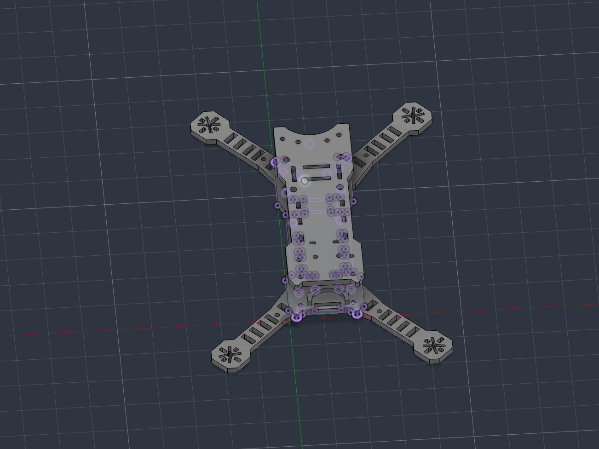
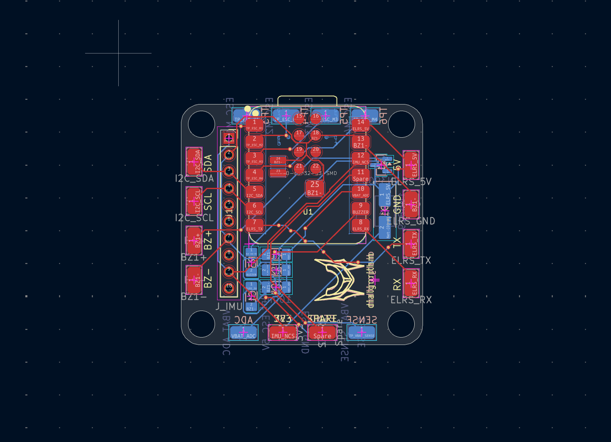
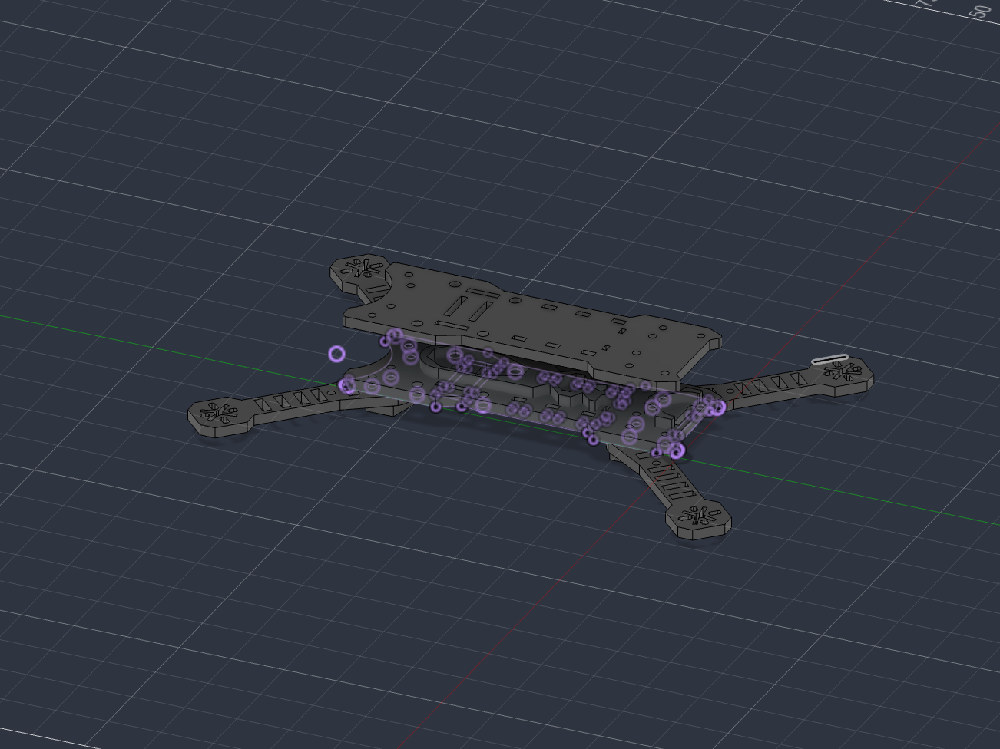

# mica

**mica** is a compact wireless FPV drone built around an **XIAO ESP32-S3**, with a custom-designed flight controller and a custom 3D-printed frame. The project focuses on building a lightweight, self-contained drone platform with **ExpressLRS (ELRS)** control, custom electronics, and a mechanical design tailored specifically to the hardware.

it features:

- XIAO ESP32-S3 as the main flight controller
- Custom-designed flight controller PCB
- ExpressLRS (ELRS) for wireless control
- Custom 3D-printed frame

## design

mica is designed around keeping the electronics and mechanical structure compact while still leaving enough space for the components required for flight.

the flight controller is built around the XIAO ESP32-S3, with the supporting electronics integrated onto a custom PCB. the frame was designed specifically around the PCB and drone hardware rather than using an off-the-shelf frame.

the 3d-printed structure keeps the drone lightweight while providing mounting points for the electronics and other components. the overall layout is kept symmetrical to help maintain the center of gravity and make the drone predictable during flight.

## Schematics + PCB

Designed using KiCad.

| Schematic                          | PCB                    |
| ---------------------------------- | ---------------------- |
|  |  |

## CAD

final 3d mockup of the drone frame.

|                                   |                                     |
| --------------------------------- | ----------------------------------- |
|  |  |

the frame is 3d printable and was designed specifically around mica's electronics and component layout.

## BOM

the complete bill of materials is available in [`bom.csv`](bom.csv).
